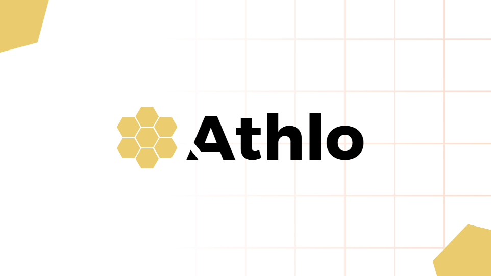

# Athlo 🏆
Conectando pessoas através do esporte.

Athlo é um aplicativo mobile desenvolvido com Flutter e Firebase com o objetivo de conectar pessoas através do esporte, permitindo a criação, descoberta e interação em comunidades esportivas baseadas em localização.

O aplicativo integra recursos de rede social, geolocalização e comunicação em tempo real utilizando Firebase Cloud Firestore e Google Maps API.

---

## 📱 Preview

  

---

## 🚀 Tecnologias Utilizadas

- Flutter
- Dart
- Firebase Authentication
- Firebase Cloud Firestore
- Firebase Storage
- Firebase Cloud Functions
- Google Maps API
- Git & GitHub

---

## 🏗️ Arquitetura

- Arquitetura modular
- Separação de responsabilidades (UI, lógica e serviços)
- Camadas dedicadas para integração com Firebase
- Uso de listeners em tempo real com Cloud Firestore
- Controle de permissões via Firebase Security Rules

---

## 🔐 Autenticação

- Cadastro com email e senha
- Login tradicional
- Login com Google
- Recuperação de senha
- Gerenciamento de conta

---

## 🌍 Principais Funcionalidades

### 📰 HomeFeed Interativo
- Feed dinâmico inspirado em redes sociais
- Vídeos publicados por comunidades
- Curtidas em publicações
- Acesso direto à comunidade pelo feed

---

### 🔎 Pesquisa e Descoberta de Comunidades
- Listagem de comunidades sugeridas
- Filtro por tipo de esporte
- Visualização de imagens e descrição
- Redirecionamento para localização via Google Maps
- Inscrição na comunidade

---

### ➕ Criação de Comunidades

Criação de comunidades com:

- Nome
- Tipo de esporte
- Categoria
- Endereço e geolocalização
- Descrição
- Foto principal
- Até 3 fotos adicionais
- 1 vídeo de apresentação

As comunidades criadas passam a ser indexadas para busca e visualização no mapa.

---

### 🗺️ Mapa Interativo

- Visualização das comunidades georreferenciadas
- Representação visual por imagem principal
- Acesso direto à página da comunidade

---

### 💬 Chat em Tempo Real

Dentro das comunidades:

- Mensagens de texto
- Envio de fotos e áudios
- Compartilhamento de mídias
- Reprodução de vídeos (controle de velocidade até 2x)
- Acesso ao perfil de membros

---

### 👤 Perfil do Usuário

- Até 6 fotos
- Foto principal
- Bio personalizada
- Idade
- Edição de informações

---

### ⭐ Minhas Comunidades

- Lista das comunidades inscritas
- Acesso ao chat
- Opção de sair da comunidade

---

### ⚙️ Configurações

- Alteração de senha
- Gerenciamento de conta
- Logout
- Termos do aplicativo

---

## 🧠 Conceitos Técnicos Aplicados

- Modelagem de dados no Cloud Firestore
- Estruturação de subcollections
- Regras de segurança com controle de ownership
- Comunicação em tempo real com listeners
- Upload e gerenciamento de mídia via Firebase Storage
- Integração com API externa (Google Maps)
- Versionamento com Git

---

## ▶️ Como executar o projeto

1. Clone o repositório  
2. Execute `flutter pub get`  
3. Configure seu próprio arquivo `google-services.json` em um projeto Firebase  
4. Habilite Authentication, Firestore e Storage no console Firebase  
5. Execute `flutter run`

> Observação: É necessário configurar um projeto Firebase próprio para funcionamento completo.

---

## 📌 Status do Projeto

Projeto desenvolvido como Trabalho de Conclusão de Curso (TCC).

Atualmente finalizado e funcional, com foco educacional e de portfólio.
